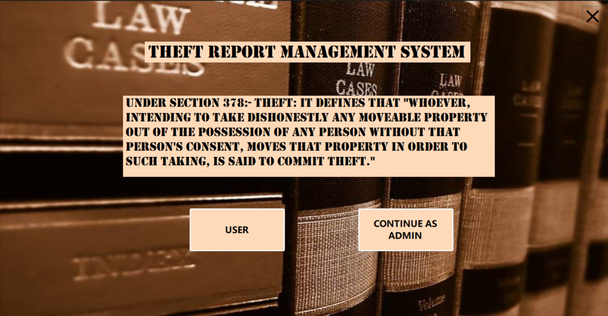
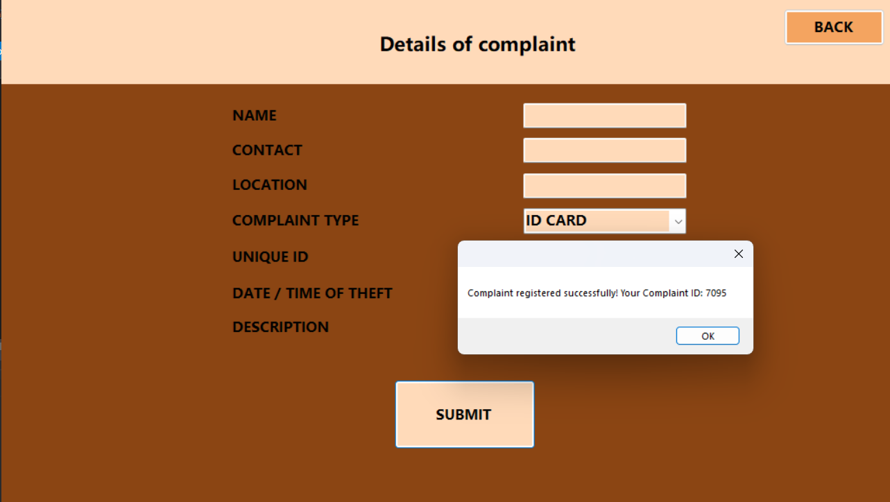
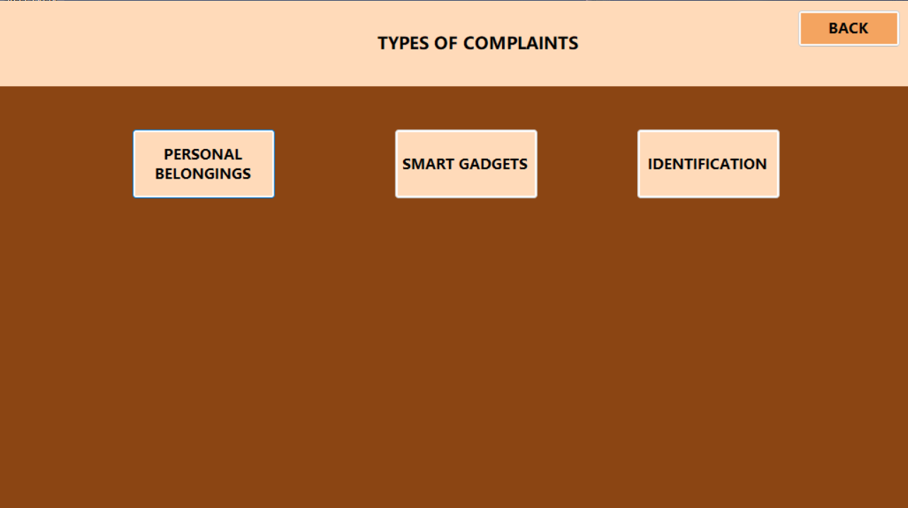
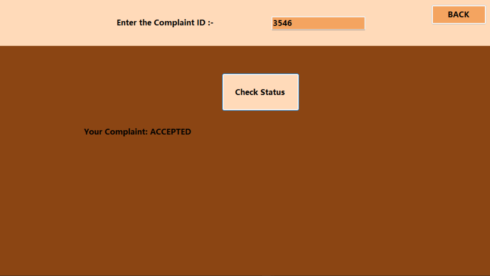
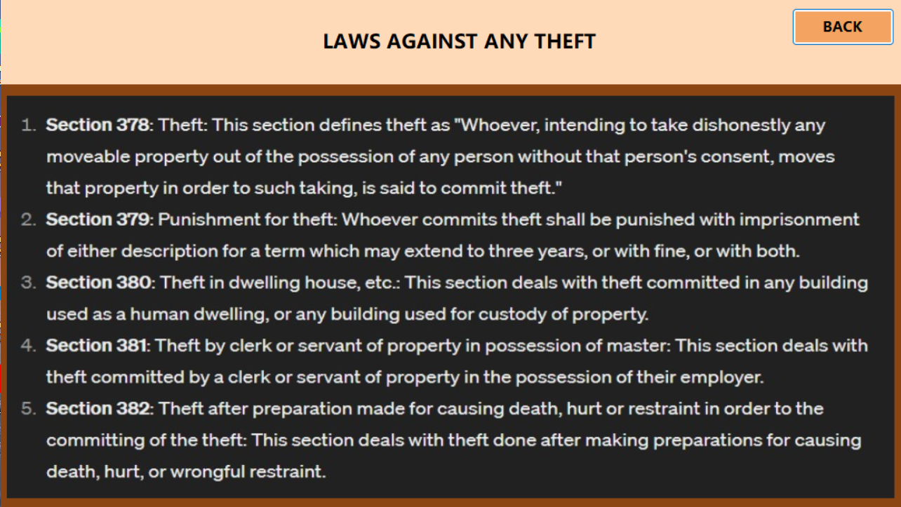
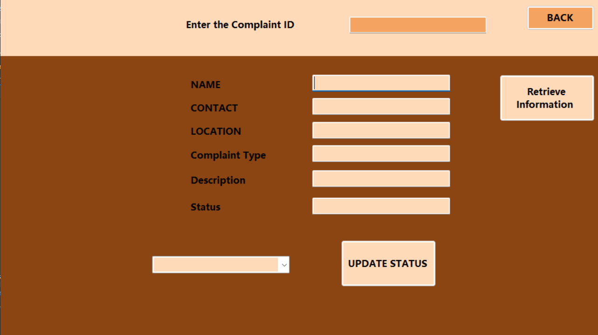
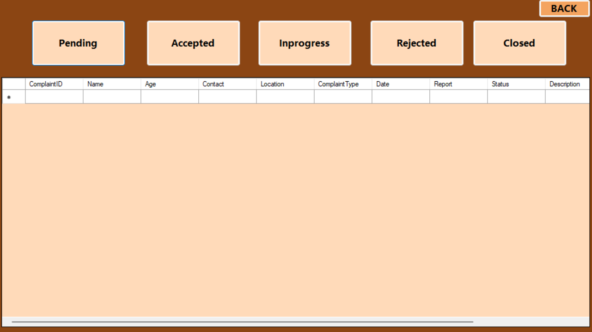

# Theft Report Management System

**Note:** This project is compatible with **Visual Studio 2015** only.

## 📌 Overview

The Theft Report Management System is a desktop application developed using **VB.NET** and **MySQL Server**. It streamlines the process of reporting and managing theft cases by digitizing records, automating workflows, and enhancing data security.

---

## 📷 Project Screenshots

### Startup Page



### Home Page


### Theft Report Complaint Entry Form



### Theft Report Complaint Types



### Theft Report Status Checking Page



### Theft Report Crime Laws



### Theft Reports Complaint Retrieval Page



### Theft Report Summary



---

## 📋 Scope of the Project

- **Digital Record Management:** Transition from manual to digital handling of theft records.
- **Comprehensive Data Handling:** Manage details related to thefts, law enforcement, and court proceedings.
- **Report Generation:** Generate detailed theft reports for analysis and record-keeping.
- **User-Friendly Interface:** Design intuitive interfaces for ease of use.
- **Backend Implementation:** Utilize VB.NET for frontend and MySQL Server for backend operations.
- **Data Security:** Ensure the confidentiality and integrity of sensitive information.
- **User Support:** Incorporate a help module to assist users in navigating the system.

---

## 🛠 Problem Definition

The traditional manual system for managing theft records is:

- **Inefficient:** Time-consuming processes hinder prompt action.
- **Error-Prone:** Manual data entry increases the risk of inaccuracies.
- **Inaccessible:** Difficulty in retrieving information quickly impedes decision-making.
- **Insecure:** Lack of robust security measures compromises data safety.
- **Paper-Dependent:** Excessive reliance on physical documents leads to clutter and loss.

---

## 🎯 Objectives

- **Efficiency:** Develop a system that streamlines the management of theft records.
- **Automation:** Reduce manual intervention to minimize errors and save time.
- **Security:** Implement measures to protect sensitive data from unauthorized access.
- **Accessibility:** Enable quick retrieval and tracking of theft reports.
- **User Support:** Provide guidance through an integrated help module.

---

## ✅ Conclusion

The Theft Report Management System offers a modern solution to the challenges posed by traditional methods of handling theft cases. By digitizing records and automating processes, it ensures:

- **Prompt Reporting:** Users can report thefts swiftly without physical visits.
- **Enhanced Tracking:** Monitor the status of complaints in real-time.
- **Reduced Paperwork:** Minimize reliance on physical documents.
- **Improved Accuracy:** Automated data handling reduces errors.
- **User Empowerment:** Facilitate reporting without hesitation through an intuitive platform.

---

## 🚀 Getting Started

1. **Prerequisites:**
   - Visual Studio 2015
   - MySQL Server

2. **Setup:**
   - Clone the repository:
     ```bash
     git clone https://github.com/raquib-adnan/TheftReportManagementSystem.git
     ```
   - Open the solution file in Visual Studio 2015.
   - Configure the database connection settings as per your MySQL setup.
   - Build and run the application.

---
